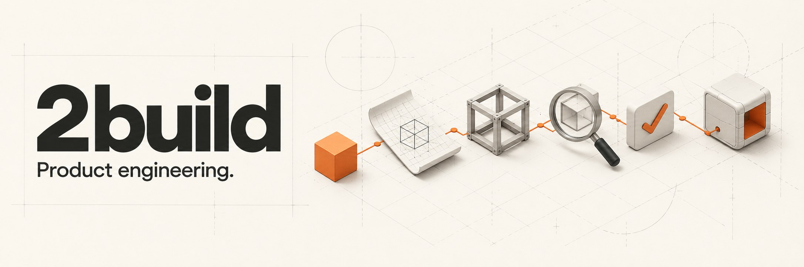
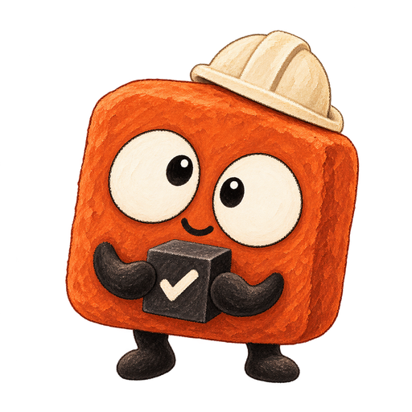

# 2build

English | [Tiếng Việt](README.vi.md) | [中文](README.zh.md) | [日本語](README.ja.md) | [한국어](README.ko.md)





**Review the prototype. Let Autopilot do the rest.**

**[Start with Autopilot](#install) · [Read the docs](docs/install.md)**

2build helps your coding agent finish a feature. Give it a requirement, review the UI prototype, then let **Autopilot** write code, check it and fix issues.

For a small UI task, aim to see a prototype in **~5 minutes**; timing depends on the task, model and project.

- **Quality:** code is reviewed, tested and fixed before handoff.
- **Productivity:** the agent handles each step without constant reminders.
- **Efficiency:** adjust the prototype early to reduce rework.

Works with **Claude Code, Codex, Antigravity, OMP and Grok**, and any coding agent that supports Claude Code skills.

A 2found product. Previously named babysit; the `bbs` CLI, `bbs:` skills and existing `.babysit` state remain compatible. See [branding and naming](BRANDING.md).

<a id="install"></a>

## Install with one prompt

Paste this into your coding agent with terminal access:

```text
Install 2build for the coding agent I am using. Follow
https://raw.githubusercontent.com/2found/2build/main/docs/install.md. Detect my OS and
current agent, reuse a working bbs installation or install the CLI, then install the
skill pack for this agent only. Verify bbs --version and the installed skills; report
any missing prerequisite instead of claiming success. Tell me whether I need to restart
and give me the exact Autopilot invocation for my agent to run my first small task.
```

You need a supported coding agent and its existing model access. Claude Code and Codex also need their CLI on PATH. 2build has no separate model account to configure; your agent's normal usage charges apply. **Orca is only required for Foreman.** See [installation and troubleshooting](docs/install.md).

<details>
<summary>Prefer terminal commands? Homebrew on macOS or Linux</summary>

```bash
brew tap 2found/2build https://github.com/2found/2build
brew install 2found/2build/bbs
bbs install
```

`bbs install` auto-detects Claude Code, Codex and Antigravity. For OMP, Grok and other compatible agents, follow the [skill installation guide](docs/install.md#omp-grok-and-other-compatible-agents). Use `bbs install claude`, `bbs install codex`, or `bbs install antigravity` to select one. Restart that agent after installation. Without Homebrew, use a [release archive](docs/install.md#release-archives-macos-or-linux); on Windows, use WSL.

</details>

## Start a new project

[**2build starters**](https://github.com/2found/2build-starters) provides versioned
project templates with an agent harness, architecture guidance, tests and local QA.
The first template is `hono-bun`: a Bun/Hono API with TypeScript and Zod.

`bbs bootstrap` and `bbs starter check` are available in CLI 1.95.0+. The stable
starter is ready to download directly from GitHub. Follow the
[starter quick start](docs/starters.md) for commands and prerequisites.

<a id="autopilot-one-ticket"></a>

## Try your first ticket

1. Restart your agent, open a Git repo and choose a small bug or feature with a clear success check. Autopilot works and commits on your current checkout; create your preferred branch first if you want isolation.
2. Invoke the **skill in agent chat**, replacing the example with your task:

   | Agent | Example |
   |-------|---------|
   | Claude Code | `/bbs:autopilot "Add a saved-search screen. Show a prototype first, then implement, review and QA."` |
   | Codex | `$bbs:autopilot "Add a saved-search screen. Show a prototype first, then implement, review and QA."` |
   | OMP | `/autopilot "Add a saved-search screen. Show a prototype first, then implement, review and QA."` |
   | Grok | `/bbs:autopilot "Add a saved-search screen. Show a prototype first, then implement, review and QA."` |
   | Antigravity / other compatible agents | Ask it to use the installed `autopilot` skill for your task. |

3. Review the plan and, for UI work, open the prototype. Adjust the layout, flow or scope here. When Autopilot returns a `/goal` block, paste it into the same agent to start execution. For an agent without goal mode, include `--stop-after=plan` in your first request to hold this review checkpoint, then follow the native resume instruction in its handoff.
4. Let Autopilot implement, review, fix, test and run QA. It returns a local commit and evidence when the ticket passes its completion gates; a blocked run names the missing input. After a restart, give it the ticket ID from the handoff to resume.

No Orca, new worker session or project configuration is needed for this first ticket. You choose the session's model before starting. [Inspect progress and recover a session](docs/companion-cli.md).

## Keep building with 2found

When your product needs more, choose the tool for the next job:

| Your next step | Explore |
|----------------|---------|
| Add an AI agent to your product | [**Soot**](https://trysoot.com), powered by **2agent** — **agent as config** — add config to your source code. Add an AI teammate. |
| Deploy what you built | [**2server**](https://github.com/2found/2server) — deploy and operate apps on infrastructure you own. |
| Help customers discover your product | [**2market**](https://2found.dev/#2market) — a marketing workspace in development, bringing product context, content and channels into one flow. |

Start with 2build for the engineering work; explore these products when the need comes up.

## Pick the work, not the job title

Autopilot routes a task to one of five product-team archetypes. You can also name the workflow or invoke a skill directly.

| Archetype | Use it to |
|-----------|-----------|
| Prototyper | Validate a risky idea before investing in production code. |
| Builder | Deliver a feature or bug fix through review and QA. |
| Sweeper | Remove weight or improve a measured hot path while preserving behavior. |
| Grower | Improve copy, conversion or a measurable growth experiment. |
| Maintainer | Diagnose failures and harden reliability, security or dependencies. |

Browse the [skill index](docs/skills.md) for individual skills and workflow examples.

<a id="configure-foreman"></a>
<a id="foreman-multi-ticket-projects"></a>

## Larger projects: Foreman

For dependent tickets and supervised workers, [Foreman](docs/foreman.md) uses [Orca](https://www.onorca.dev) to plan a project, isolate child tickets in worktrees, dispatch ready work and run project-wide QA. It presents the parent plan/design for review before production dispatch; explicit `--auto` delegates that review. The configured finish policy controls delivery.

<details>
<summary>CLI and configuration details</summary>

## Skills and CLI

Skills are the agent-facing workflows; `bbs` is the companion CLI they use. `/bbs:foreman` runs the project coordinator; `bbs foreman` manages model policy lookups, durable Foreman records, contracts, and reports. `/bbs:autopilot` runs the one-ticket workflow; `bbs autopilot` exposes its checkpoint and state helpers. `bbs ticket` owns ticket identity, DAG relations, evidence, test surfaces, delivery, and cleanup.

Useful CLI entry points:

```bash
bbs dashboard
bbs foreman report <parent-ticket>
bbs ticket dag <parent-ticket>
bbs autopilot snapshot --json
bbs autopilot recover --json
```

`snapshot` reads canonical ticket state and gate evidence; `recover` adds bounded artifact excerpts for resuming work.

Run `bbs <subcommand> --help` for usage. More detail: [companion CLI](docs/companion-cli.md), [profiles](docs/profiles.md), and [operations](docs/operations.md).

## Semantic decisions

`semantic-decision` makes task sizing, complexity, routing, test impact and review
judgments an explicit reusable skill step. Its default provider is the current
LLM; no configuration or extra model process is needed. To use Cloudflare:

```bash
bbs config set semantic_decision_provider cloudflare
bbs config set semantic_decision_model clef-flash  # or clef
```

Set `CLOUDFLARE_ACCOUNT_ID` and `CLOUDFLARE_API_TOKEN` in the environment or
`~/.babysit/.env`. Only user configuration selects the provider; project policy
can restrict external inference. Cloudflare errors or uncertain answers fall
back to the current LLM. See the [skill](.claude/skills/semantic-decision/SKILL.md)
and [contract](.claude/skills/references/semantic-decision.md). See
[settings without a dashboard control](docs/operations.md#settings-without-a-dashboard-control)
for config paths, defaults, project limits and human-review behavior.

</details>

## Documentation

[Install and troubleshoot](docs/install.md) · [Choose a skill](docs/skills.md) · [Inspect progress](docs/companion-cli.md) · [Coordinate a project](docs/foreman.md)

For coding agents, [llms.txt](llms.txt) links directly to the Markdown guides and runtime contracts.

## Repository layout

- `bbs` — the multicall binary (gitignored build output; `go build -o bbs ./cmd/bbs`). Hooks are compiled subcommands, `bbs hooks <name>`.
- `.claude/skills/` — agent skills and workflow references.
- `internal/` — Go CLI and services.
- `web/` — dashboard SPA, embedded in release builds.
- `tests/`, `docs/` — verification suites and user documentation.

## Telemetry

Skill usage is recorded locally as JSONL under `~/.babysit/analytics/`; telemetry is the primary feedback channel for unattended runs.

## License

MIT.
